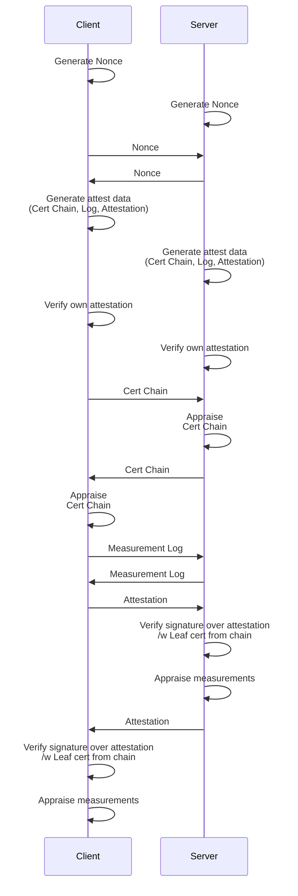

## Overview

Sprockets provides a secure transport protocol for use in the Oxide bootstrap
network. It is designed specifically to work with a Root of Trust (RoT) capable
of providing device identities, signing capabilities, and a mechanism to
retrieve measurements for remote attestation. The protocol utilizes TLS 1.3
via [rustls](https://github.com/rustls/rustls) for secure session establishment
between bootstrap agents with authentication provided by local RoTs. Remote
attestation is performed over secure TLS 1.3 channels.

### Test Data

Test cases rely on a PKI that we define in `tls/test-keys/config.kdl`. Before
`cargo test` will execute tests as expected the test PKI must be generated
using the `pki-playground` tool. This is automated by `tls/build.rs`.

### Remote Attestation

After the TLS handshake is complete, the peers on either end of the connection
exchange, verify, and appraise attestations generated by their respective RoTs.
The protocol used to carry out this process is roughly:

